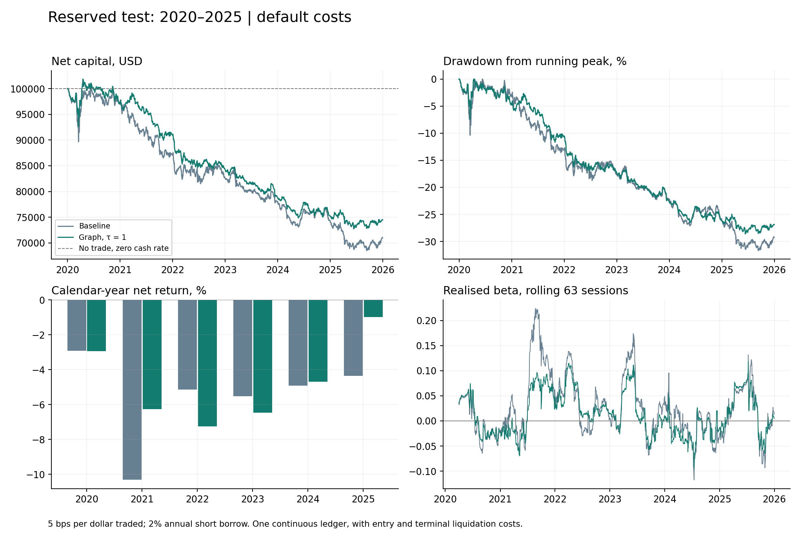

# Market-Neutral Trading Algorithm

**Joel Cerraga · Quantitative research · Complete research release**

A reproducible Python study of constrained equity reversal, graph diffusion and persistent-homology descriptors. The fixed final evaluation is complete. **The proposed trading advantage is not demonstrated:** the primary graph strategy loses money after costs, and its improvement over the baseline remains uncertain.

## Start here

Visit the [research landing page](https://joelcerraga.github.io/Market-Neutral-Trading-Algorithm/) or the [interactive graph gallery](https://joelcerraga.github.io/Market-Neutral-Trading-Algorithm/explorers/). The static website is supplied in this repository and is served when GitHub Pages is enabled for `main` / root.

1. Read the [final paper](paper/final/Market-Neutral-Trading-Algorithm-Final-Paper.pdf), including its discussion and conclusion, or the [concise findings](outputs/final/milestone-5-results.md).
2. Open the [executed final notebook](notebooks/05-final-evaluation.ipynb) for the walkthrough, implementation excerpts and replay checks.
3. Download and open the [final 3D explorer](outputs/final/topology/Final-Test-Landscape-Explorer.html) in a browser for 72 monthly landscapes and paired birth–death diagrams. Rotation, zoom, hover, a date slider and playback are included; JavaScript is embedded for offline use. GitHub's file preview does not run the explorer.
4. Browse the [output index](docs/OUTPUTS.md), [milestone decisions](docs/milestone-decisions.md) and [release decisions](docs/release-notes.md).
5. Follow [START_HERE.md](START_HERE.md) for local setup and reproduction.



## Download profiles

Both archives contain all five notebooks, all 175 saved research outputs, four interactive HTML explorers, the final paper and its editable source, historical paper drafts, protocols, tests and CI configuration.

| Archive | Intended use | Historical input data |
| --- | --- | --- |
| `Market-Neutral-Trading-Algorithm-GitHub.zip` | Extract and upload the contents to a public repository | Acquisition manifests and snapshot hashes; vendor caches and processed price inputs omitted |
| `Market-Neutral-Trading-Algorithm-Complete.zip` | Personal archive and exact-data offline replay | Both original acquired data vintages and processed input snapshots included |

The archives contain a `PACKAGE_README.md` identifying their profile and a SHA-256 `package-manifest.json`. Temporary renders, environments, Git history, TeX build intermediates and redundant ZIPs are excluded. No software licence has been selected on the author's behalf.

## Quick start without vendor data

Use Python 3.12 in a virtual environment; platform-specific commands are in [START_HERE.md](START_HERE.md).

```bash
python scripts/verify_release.py
python -m pip install -r requirements-notebook.txt
python -m unittest discover -s tests -v
python run_research.py --output tmp/synthetic-demo
```

These commands work with either archive. They verify the download, run the focused tests and run the synthetic mechanics example in a separate output directory. The saved historical results remain available to inspect without rerunning experiments. Full historical replay requires the **Complete** archive; then `python run_final.py` uses its frozen data.

## What the trading tests found

| Period | Baseline CAGR | Graph CAGR, τ = 1 |
| --- | ---: | ---: |
| Development, 2010–2016 | −3.10% | −4.37% |
| Validation, 2017–2019 | −5.83% | −5.27% |
| Final test, 2020–2025 | −5.57% | −4.80% |

These use 5 bps per dollar traded and 2% annual short borrow. In the final test, the graph-minus-baseline annualised arithmetic mean is +0.73 percentage points. Its 95% paired stationary-bootstrap interval spans −1.66 to +3.25 percentage points; the fixed-family adjusted interval spans −2.14 to +3.85. These are arithmetic-mean intervals, not CAGR intervals. All 22 final cases and all six calendar years are retained. None of the four predeclared necessary evidence conditions was met.

As Politis and Romano (1994) explain in *The Stationary Bootstrap*, random blocks provide a resampling construction for dependent observations. The same blocks are applied to baseline, graph and their difference. As Lehmann and Romano (2005) explain in *Testing Statistical Hypotheses*, inference about several hypotheses requires distinguishing individual from family-wise error. The three-mean Bonferroni allocation here remains approximate and conditional on marginal interval coverage; it cannot repair survivor selection or the whole model-search history.

## What topology adds

The complete rolling correlation matrix supplies asset distances. A Vietoris–Rips filtration produces component-merger and loop lifetimes, with explicit treatment of the essential H0 interval. All four descriptors are retained at 63, 126 and 252 sessions. The final stage has 4,524 rows on 1,508 common dates and applies the original twelve development-fitted control models without refitting.

As Mantegna (1999) explains in *Hierarchical structure in financial markets*, correlations can support a distance representation. Bubenik (2015), in *Statistical topological data analysis using persistence landscapes*, provides the function representation used for the 3D companion. These relationships support the construction and visualisation; they do not establish a profitable trading rule.

H0 substantially overlaps ordinary correlation. H1 is more window-sensitive, and the primary-window H1-total and H1-maximum control models produce final-test R² −0.217 and −0.088. No topology overlay was introduced. All 288 final monthly diagram-bound checks pass; a passing bound does not establish a stable financial regime or useful forecast.

## Data, timing and scientific scope

The original cache contains 24 surviving US stocks plus SPY, with 2,768 price sessions during 2009–2019. The separate final vintage contains 1,761 prices per series from 31 December 2018 through 31 December 2025; 2019 supplies warm-up and 1,508 sessions belong to the final test. Overlapping returns passed the predeclared vintage audit. The original observations and source calculations remain frozen.

**All three research periods are now observed.** The final protocol was locked before its observations were acquired in this project, but the years were publicly known historical periods and the companies were selected retrospectively. This is a reserved stage in the workflow, not a prospective blind trial. It lacks a point-in-time universe, comprehensive delisting outcomes, historical stock-level borrow availability and raw-price execution/corporate-action cash accounting.

Decision portfolios have approximately zero dollar and estimated SPY-beta exposure, gross at most 100% and at most 8% per name. A close-t decision executes at t+1 and first earns a new-position return ending at t+2. Entry costs, drift turnover, calendar-day borrowing and terminal liquidation are included. The final ledger is continuous across all six years. Realised beta and other factors can remain nonzero.

## Reproduction and validation

Python 3.12 is recommended; the package declares Python 3.11–3.13. Requirements pin the numerical and topology dependencies. The private research ZIP includes both acquired vintages for offline replay after dependency installation. `run_final.py` uses cached observations and performs no network acquisition.

The fifth notebook contains ten executed code cells. **41 focused tests pass.** The first run contained one empty sensitivity-ledger CSV; the repair record retains the original manifest, adds verified atomic writes and requires replay of every unaffected numerical-output hash. All 22 saved ledgers are checked against their recorded scenario summaries. This repair changes output persistence, not the trading rule or result selection.

The GitHub package excludes the vendor caches and processed price input snapshots. `fetch_historical.py` and `fetch_final.py` request the declared histories, but a changed provider vintage will be rejected by the retained snapshot guards. Final acquisition also checks the original input snapshot first; running the two fetch scripts does not guarantee exact reproduction. A different vintage requires a documented experiment revision. Do not edit a lock to force a match. See [data/README.md](data/README.md) for the precise boundary between public inspection, synthetic replay and exact historical replay.

The release keeps byte-for-byte hashes and disables Git line-ending conversion through `.gitattributes`; this protects protocol and snapshot checks on Windows. Run the package verifier immediately after extraction or checkout. Deliberate later edits or regenerated artifacts can change those hashes without invalidating the historical research record.

## Structure

| Location | Purpose |
| --- | --- |
| `market_neutral/` | Data, graph, portfolio, inference, topology and final-evaluation modules |
| `protocol/` | Four frozen experiment definitions and local pre-run hashes |
| `run_final.py` | All 22 final cases, paired inference, diagnostics, figures and HTML |
| `run_topology.py` | Original descriptor study on development/validation |
| `run_comparison.py` | All 44 earlier graph/baseline cases |
| `run_historical.py`, `run_research.py` | Historical baseline and synthetic mechanics |
| `notebooks/` | Five explanatory notebooks with retained outputs |
| `paper/sections/` | Editable text with numbered equations and implementation excerpts |
| `paper/manuscript.md` | Complete editable Harvard-referenced manuscript |
| `paper/references-harvard.md` | Alphabetical Harvard references only |
| `docs/milestone-decisions.md` | Problem-solving record for the five research milestones and final assembly |
| `outputs/final/` | Every final ledger, comparison, cost/exposure diagnostic and topology transfer |
| `tests/`, `validation/` | Focused checks and execution/artifact evidence |
| `.github/workflows/` | Focused test suite configured for pushes and pull requests |
| `docs/OUTPUTS.md`, `docs/output-inventory.csv` | Browsable output guide and exhaustive output checksums |
| `scripts/package_release.py` | Reproducible archive builder |
| `index.html`, `explorers/` | Research landing page, graph gallery and four dedicated explorer pages |
| `assets/`, `scripts/build_site.py` | Site styling, data-derived previews, two white-background social thumbnails and the site builder |

## Writing and remaining work

The final paper maintains 30 numbered equations, 27 tables, 16 figures, 15 code listings and 24 Harvard references, plus the title, abstract, contents, abbreviations and mathematical symbols. Bibliographies contain references only; consultation notes remain in a separate source register.

**The final paper is assembled.** It uses A4 portrait pages throughout, an Arial-compatible body, centred captions beneath figures/tables/equations, automatic contents and caption registers, a dedicated discussion and conclusion, and a reproduction appendix. The attached papers informed the writing and layout; the study retains its own research sequence. The final bibliography contains Harvard references only.

`paper/update_manuscript.py` refreshes the editable text. `paper/assemble_final_paper.py` prepares and compiles the final typesetting source. Presentation checks are recorded in `validation/final-paper-validation.json`; they do not change the frozen strategy or its results.

The completed study is published in this repository. Future strategy revisions require newly reserved evidence; the 2020–2025 results cannot be reused as an untouched test.

The website presents the frozen results without rerunning the study. Its four embedded explorers load the original HTML artifacts unchanged. `python scripts/build_site.py` regenerates the six pages and preview figures from saved data; `python scripts/verify_site.py` checks navigation, social metadata and preservation of all research outputs. See the website section in `START_HERE.md` and the [website milestone notes](docs/website-milestone.md).

## References

Bubenik, P. (2015) ‘Statistical topological data analysis using persistence landscapes’, *Journal of Machine Learning Research*, 16(3), pp. 77–102. Available at: [https://jmlr.org/papers/v16/bubenik15a.html](https://jmlr.org/papers/v16/bubenik15a.html) (Accessed: 21 September 2026).

Lehmann, E.L. and Romano, J.P. (2005) *Testing Statistical Hypotheses*. 3rd edn. Springer Texts in Statistics. Springer. doi: [10.1007/0-387-27605-X](https://doi.org/10.1007/0-387-27605-X).

Mantegna, R.N. (1999) ‘Hierarchical structure in financial markets’, *The European Physical Journal B*, 11, pp. 193–197. doi: [10.1007/s100510050929](https://doi.org/10.1007/s100510050929).

Politis, D.N. and Romano, J.P. (1994) ‘The Stationary Bootstrap’, *Journal of the American Statistical Association*, 89(428), pp. 1303–1313. doi: [10.1080/01621459.1994.10476870](https://doi.org/10.1080/01621459.1994.10476870).
